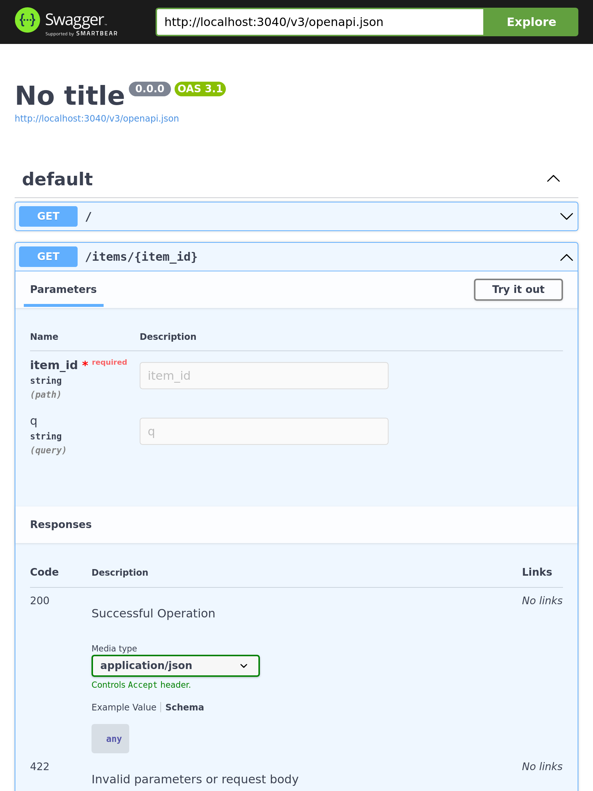
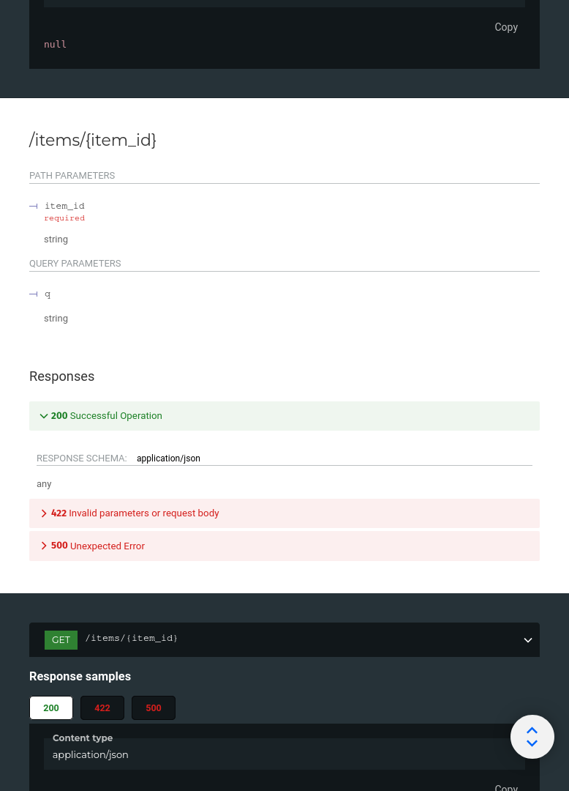
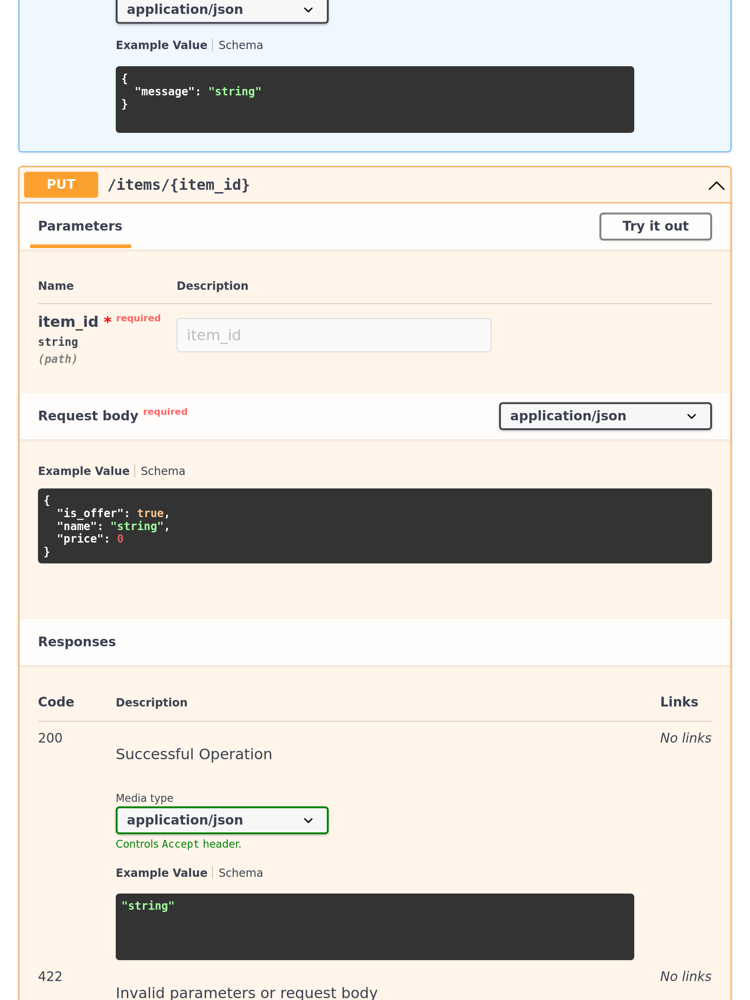
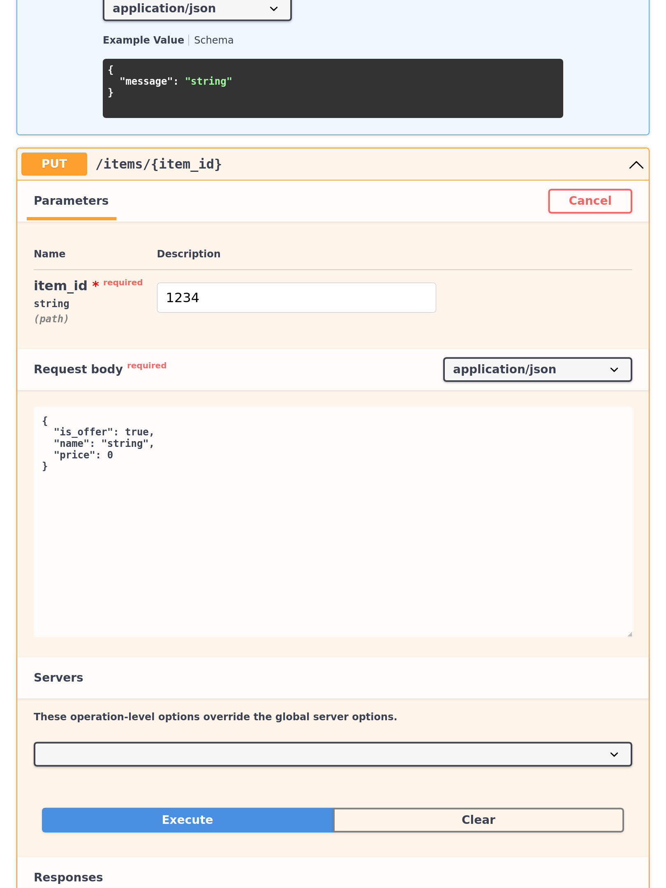
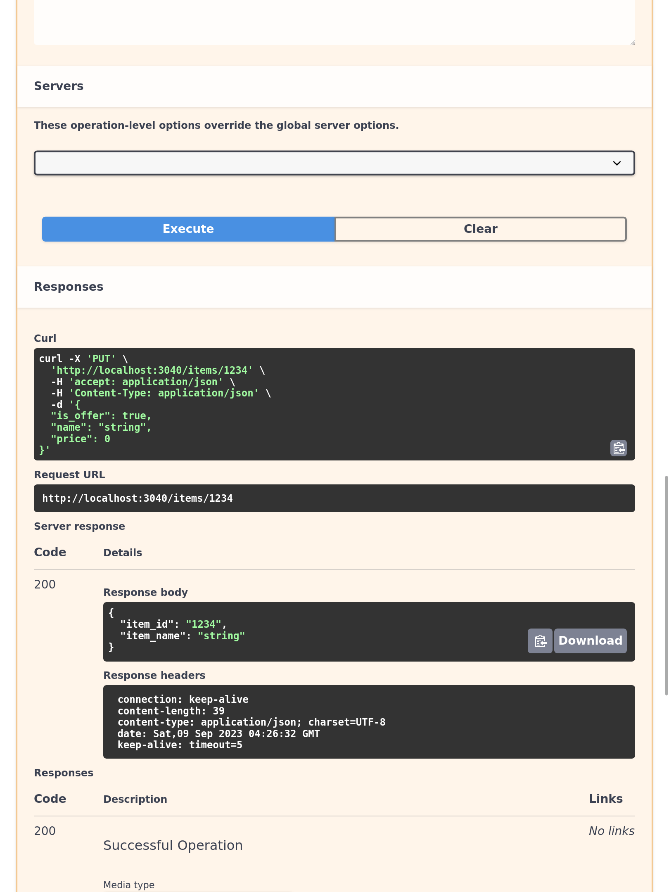

# Beff

> The power of TRpc and Zod, the simplicity of FastAPI. Powered by a compiler à la Tailwind.

## Development Environment Requirements

- Node 18+

## Runtime support

- Node 18+
- Cloudflare Workers
- Cloudflare Pages
- Deno
- Bun
- Fastly Compute@Edge
- Lagon
- Vercel
- Netlify
- AWS Lambda
- AWS Lambda
- [and more](https://hono.dev/getting-started/others)

## Installation

`npm install @beff/cli`

You will also need to install a runtime.

`npm install @beff/hono @hono/node-server`

## Example

### Create it

Create a file `beff.json` with:

```json title="/beff.json"
{
  "router": "./router.ts",
  "outputDir": "./generated"
}
```

Create a file `router.ts` with:

```ts title="/router.ts"
import { Ctx } from "@beff/hono";

export default {
  "/": {
    get: () => {
      return { Hello: "World" };
    },
  },
  "/items/{item_id}": {
    get: (c: Ctx, item_id: string, q?: string) => {
      return { item_id, q };
    },
  },
};
```

Create a file `index.ts` with:

```ts title="/index.ts"
import { serve } from "@hono/node-server";
import { buildHonoApp } from "@beff/hono";
import router from "./router";
import generated from "./generated/router";

const app = buildHonoApp({
  router,
  generated,
});
serve({
  fetch: app.fetch,
  port: 3040,
});

console.log(`Server running at http://localhost:3040/`);
console.log(`Check docs at at http://localhost:3040/docs`);
```

### Compile it

```bash
npx beff -p beff.json && \
npx esbuild index.ts --bundle --platform=node --target=node16 --outdir=dist
```

:::tip

You can also add a task in your package.json `"beff": "beff -p beff.json"` and use it with `npm run beff`.

:::

### Run it

```bash
node dist/index.js
```

### Check it

Open your browser at [http://127.0.0.1:3040/items/5?q=somequery](http://127.0.0.1:3040/items/5?q=somequery).

You will see the JSON response as:

```json
{ "item_id": 5, "q": "somequery" }
```

You already created an API that:

- Receives HTTP requests in the paths `/` and `/items/{item_id}`.
- Both paths take `GET` operations (also known as HTTP methods).
- The path `/items/{item_id}` has a path parameter `item_id` that should be an `int`.
- The path `/items/{item_id}` has an optional `str` query parameter `q`.

### Interactive API docs

Now go to [http://127.0.0.1:3040/docs](http://127.0.0.1:3040/docs).

You will see the automatic interactive API documentation (provided by [Swagger UI](https://github.com/swagger-api/swagger-ui)):



### Alternative API docs

And now, go to [http://127.0.0.1:3040/redoc](http://127.0.0.1:3040/redoc).

You will see the alternative automatic documentation (provided by [ReDoc](https://github.com/Rebilly/ReDoc)):



## Example upgrade

Now modify the `router.ts` to receive a body of a `put` request.

Declare the body using standard Typescript types.

```ts title="/router.ts"
import { Ctx } from "@beff/hono";

// highlight-start
type Item = {
  name: string;
  price: number;
  is_offer?: boolean;
};
// highlight-end

export default {
  "/": {
    get: () => {
      return { Hello: "World" };
    },
  },
  "/items/{item_id}": {
    get: (c: Ctx, item_id: string, q?: string) => {
      return { item_id, q };
    },
    // highlight-start
    put: (c: Ctx, item_id: string, item: Item) => {
      return { item_id, item_name: item.name };
    },
    // highlight-end
  },
};
```

### Interactive API docs upgrade

Now go to [http://127.0.0.1:8000/docs](http://127.0.0.1:8000/docs).

- The interactive API documentation will be automatically updated, including the new body:



- Click on the button "Try it out", it allows you to fill the parameters and directly interact with the API:



- Then click on the "Execute" button, the user interface will communicate with your API, send the parameters, get the results and show them on the screen:



### Alternative API docs upgrade

And now, go to [http://127.0.0.1:8000/redoc](http://127.0.0.1:8000/redoc).

- The alternative documentation will also reflect the new query parameter and body:


### Recap

In summary, you declare **once** the types of parameters, body, etc. as function parameters.

You do that with standard Typescript types.

You don't have to learn a new syntax, the methods or classes of a specific library, etc.

Just standard **Typescript**.

For example, for a `number`:

```ts
item_id: number;
```

or for a more complex `Item` model:

```ts
item: Item;
```

...and with that single declaration you get:

- Editor support, including:
  - Completion.
  - Type checks.
- Validation of data:
  - Automatic and clear errors when the data is invalid.
  - Validation even for deeply nested JSON objects.
- Automatic interactive API documentation, including 2 alternative user interfaces:
  - Swagger UI.
  - ReDoc.

## Type-Safe Client Generation

### Fetch Client

Read more on TODO

#### Install it

```bash
npm i @beff/client
```

#### Use it

```ts
import { buildClient } from "@beff/client";
// The client file contains only the minimal amount of data required.
import generated from "../../../generated/client";
const fetchClient = buildClient<AppRouter>({
  generated,
  baseUrl: "http://localhost:2022",
});

fetchClient["/"].get().then((result) => {
  console.log(result.Hello);
});
```

### React Query Client

Read more on TODO

#### Install it

```bash
npm i @beff/react
```

#### Use it

```ts
import { buildReactQueryClient } from "@beff/react";
// The client file contains only the minimal amount of data required.
import generated from "../../../generated/client";

export const beff = buildReactQueryClient<AppRouter>({
  generated,
  baseUrl: "http://localhost:2022",
});
```

```ts
import React from "react";
import { beff } from "./utils/beff";

export function Show() {
  const result = beff["/"].get().useQuery();
  return <div>{result.data?.Hello}</div>;
}
```

### Hono Test Client

Install `vitest`

```bash
npm i vitest
```

#### Create it

Create a file `router.test.ts` with:

```ts title="/router.test.ts"
import { test, expect } from "vitest";
import { buildHonoTestClient, buildHonoApp } from "@beff/hono";
import router from "./router";
import generated from "./generated/router";

const app = buildHonoApp({
  router,
  generated,
});

const client = buildHonoTestClient<typeof router>({ app, generated });

test("get /", async () => {
  const result = await client["/"].get();
  expect(result).toMatchInlineSnapshot(`
    {
      "Hello": "World",
    }
  `);
});
test("get /items/{item_id}", async () => {
  const result = await client["/items/{item_id}"].get(
    "the item id",
    "query param"
  );
  expect(result).toMatchInlineSnapshot(`
    {
      "item_id": "the item id",
      "q": "query param",
    }
  `);
});
```

#### Run it

```bash
npx vitest

 ✓ router.test.ts (2)
   ✓ get /
   ✓ get /items/{item_id}

 Test Files  1 passed (1)
      Tests  2 passed (2)
```
